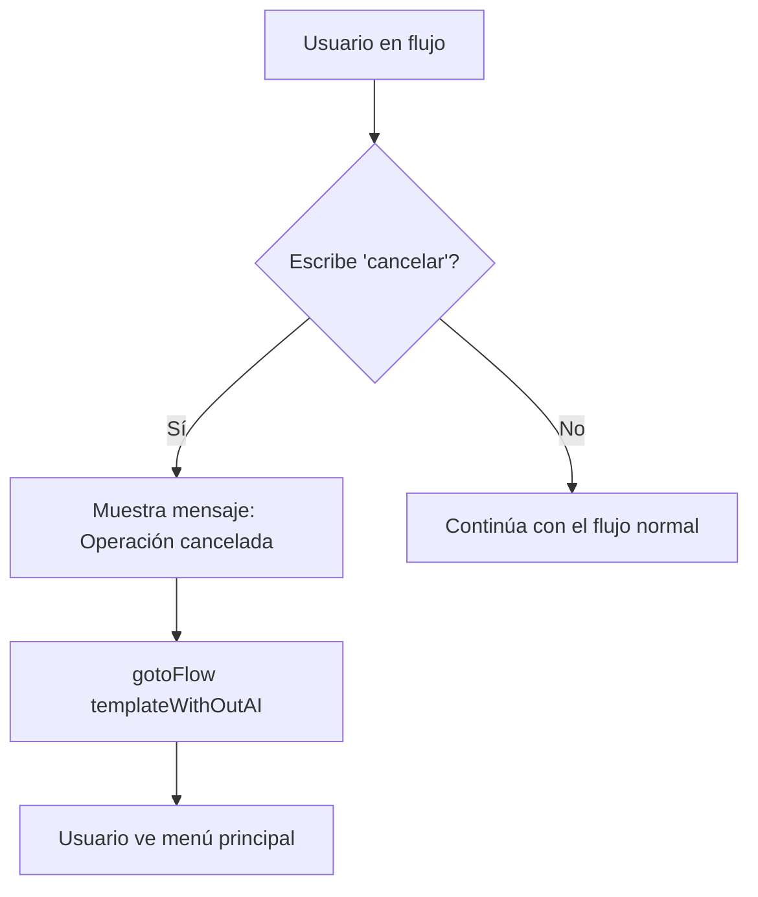

# Implementación de Cancelación de Flujos

## 📋 Resumen

Se ha implementado la funcionalidad para que los usuarios puedan **cancelar en cualquier momento** los flujos de `agregarGasto` y `agregarIngreso`, retornando al menú principal.

---

## ✨ Funcionalidades Implementadas

### 1. **Detección de Palabra Clave "Cancelar"**

El usuario puede escribir cualquiera de estas palabras en cualquier paso del flujo:
- `cancelar`
- `salir`
- `volver`

### 2. **Botón "❌ Cancelar" en Listas Interactivas**

Se agregó un botón de cancelar en cada lista de selección:
- Lista de Categorías
- Lista de Cuentas
- Lista de Métodos de Pago

### 3. **Instrucciones Visuales**

Se agregaron mensajes de ayuda indicando al usuario que puede cancelar:
- En el body de la primera lista: _"Escribí 'cancelar' en cualquier momento para volver al menú principal"_
- Al solicitar datos de transacción: _"Escribí 'cancelar' para volver al menú principal"_

---

## 🔄 Flujo de Cancelación



---

## 📁 Archivos Modificados

### 1. **agregarGasto.ts** ([src/templates/list_templates/gastosIngresos/agregarGasto.ts](src/templates/list_templates/gastosIngresos/agregarGasto.ts))

#### Cambios:
- ✅ Importado `templateWithOutAI`
- ✅ Agregado botón "Cancelar" en lista de categorías
- ✅ Agregado botón "Cancelar" en lista de cuentas  
- ✅ Agregado botón "Cancelar" en lista de métodos de pago
- ✅ Verificación de cancelación en **5 pasos de captura**:
  1. Captura de categoría
  2. Captura de cuenta
  3. Captura de método de pago
  4. Captura de datos de transacción (descripción, monto, moneda)
  5. Todos los pasos intermedios

#### Ejemplo de Implementación:
```typescript
.addAnswer('', { capture: true }, async (ctx, { state, provider, flowDynamic, gotoFlow }) => {
    // Verificar si el usuario quiere cancelar
    const userInput = ctx.body.toLowerCase().trim();
    if (userInput === 'cancelar' || userInput === 'salir' || userInput === 'volver' || ctx.body === 'cancelar') {
        await flowDynamic("🔙 Operación cancelada. Volviendo al menú principal...");
        return gotoFlow(templateWithOutAI);
    }
    
    // ... resto del código
})
```

### 2. **agregarIngreso.ts** ([src/templates/list_templates/gastosIngresos/agregarIngreso.ts](src/templates/list_templates/gastosIngresos/agregarIngreso.ts))

#### Cambios:
- ✅ Importado `templateWithOutAI`
- ✅ Agregado botón "Cancelar" en lista de categorías
- ✅ Agregado botón "Cancelar" en lista de cuentas
- ✅ Agregado botón "Cancelar" en lista de métodos de pago
- ✅ Verificación de cancelación en **5 pasos de captura**
- ✅ Mensajes de ayuda en cada paso

### 3. **cancelFlow.ts** (NUEVO - Helper) ([src/helpers/cancelFlow.ts](src/helpers/cancelFlow.ts))

Archivo helper para reutilizar lógica de cancelación:

```typescript
/**
 * Verifica si el usuario desea cancelar el flujo actual
 */
export const shouldCancelFlow = (userInput: string): boolean => {
    const normalizedInput = userInput.toLowerCase().trim();
    const cancelKeywords = ['cancelar', 'salir', 'volver', 'menu', 'inicio'];
    return cancelKeywords.includes(normalizedInput);
};

/**
 * Obtiene el mensaje de cancelación
 */
export const getCancelMessage = (): string => {
    return "🔙 Operación cancelada. Volviendo al menú principal...";
};
```

---

## 🎯 Puntos de Cancelación

### agregarGasto / agregarIngreso

| Paso | Acción | Puede Cancelar |
|------|--------|----------------|
| 1 | Mostrar lista de categorías | ✅ Botón + Palabra clave |
| 2 | Capturar categoría | ✅ Palabra clave |
| 3 | Mostrar lista de cuentas | ✅ Botón + Palabra clave |
| 4 | Capturar cuenta | ✅ Palabra clave |
| 5 | Mostrar lista de métodos de pago | ✅ Botón + Palabra clave |
| 6 | Capturar método de pago | ✅ Palabra clave |
| 7 | Solicitar datos (descripción, monto, moneda) | ✅ Palabra clave |
| 8 | Capturar y procesar datos | ✅ Palabra clave |

---

## 🧪 Casos de Prueba

### Test 1: Cancelar desde Lista de Categorías
```
Usuario: [Inicia flujo "Agregar un gasto"]
Bot: [Muestra lista de categorías con botón "❌ Cancelar"]
Usuario: [Selecciona "Cancelar"]
Bot: "🔙 Operación cancelada. Volviendo al menú principal..."
Bot: [Muestra menú principal]
✅ PASS
```

### Test 2: Cancelar escribiendo "cancelar" en cualquier paso
```
Usuario: [Inicia flujo "Agregar ingreso"]
Bot: [Muestra lista de categorías]
Usuario: [Selecciona "Salarios"]
Bot: [Muestra lista de cuentas]
Usuario: "cancelar"
Bot: "🔙 Operación cancelada. Volviendo al menú principal..."
Bot: [Muestra menú principal]
✅ PASS
```

### Test 3: Cancelar al ingresar datos de transacción
```
Usuario: [Inicia flujo "Agregar gasto"]
Bot: [Pasa por categorías, cuentas, métodos]
Bot: "✍️ Ingresá los datos de la transaccion separados por coma..."
Usuario: "volver"
Bot: "🔙 Operación cancelada. Volviendo al menú principal..."
Bot: [Muestra menú principal]
✅ PASS
```

---

## 💡 Mejoras Futuras (Opcionales)

1. **Refactorizar usando el helper `cancelFlow.ts`**:
   ```typescript
   import { shouldCancelFlow, getCancelMessage } from '~/helpers/cancelFlow';
   
   if (shouldCancelFlow(ctx.body)) {
       await flowDynamic(getCancelMessage());
       return gotoFlow(templateWithOutAI);
   }
   ```

2. **Agregar confirmación antes de cancelar** (solo en el último paso):
   ```
   Usuario: "cancelar"
   Bot: "¿Estás seguro que querés cancelar? Escribí 'si' para confirmar o cualquier otra cosa para continuar"
   ```

3. **Guardar estado parcial** para permitir reanudar:
   ```typescript
   await state.update({ 
       draftTransaction: { category, account, method },
       canResume: true 
   });
   ```

4. **Agregar palabra clave "atrás"** para volver al paso anterior (no cancelar todo)

---

## 🔍 Verificación

✅ Linting pasado sin errores  
✅ Ambos flujos (agregarGasto y agregarIngreso) actualizados  
✅ Botones "Cancelar" agregados en todas las listas  
✅ Detección de palabras clave implementada en todos los pasos  
✅ Mensajes de ayuda agregados  
✅ Helper `cancelFlow.ts` creado para reutilización  

---

## 📚 Documentación Adicional

- Ver [README.md](README.md) para arquitectura general
- Ver flujos en [Flujos de Conversación](README.md#-flujos-de-conversación)

---

**Implementado con ❤️ para mejorar la experiencia de usuario en Pagado Bot**
