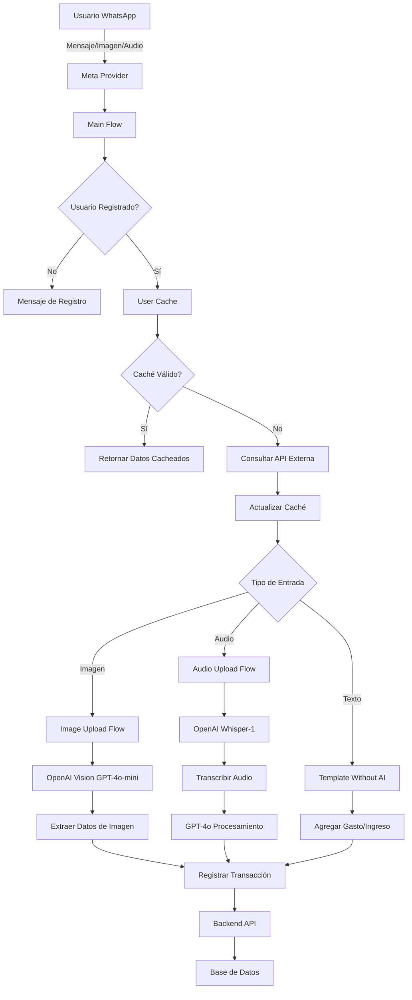
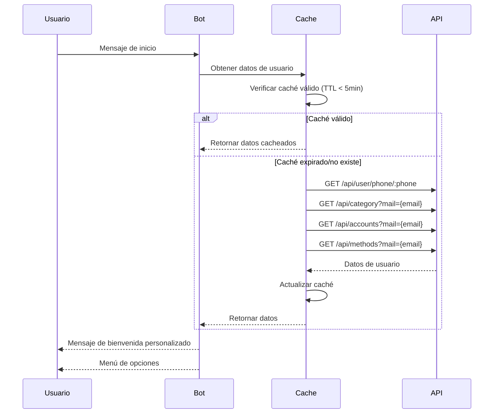
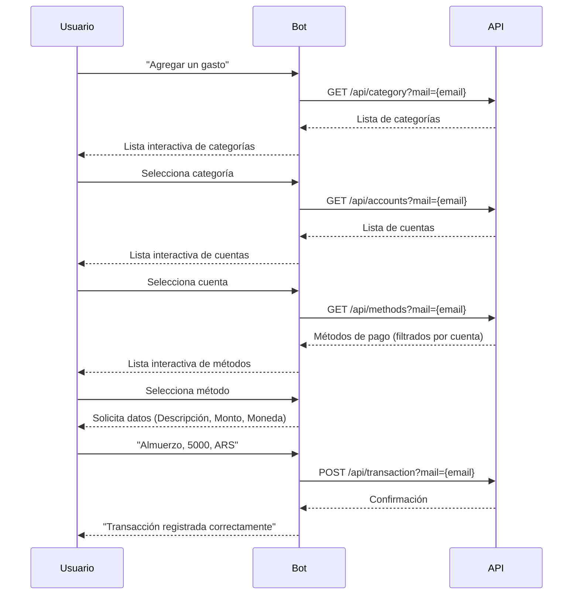
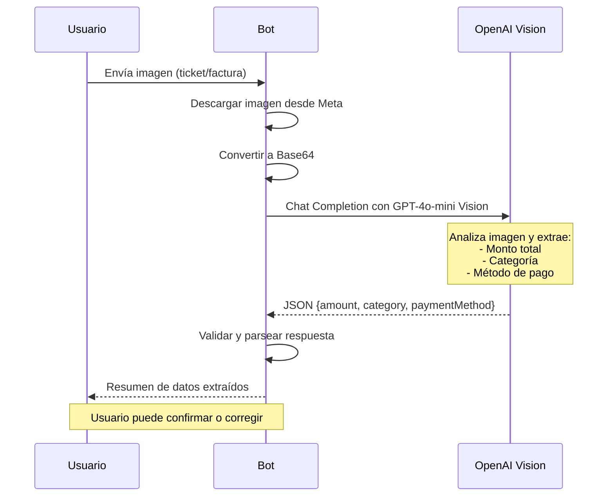
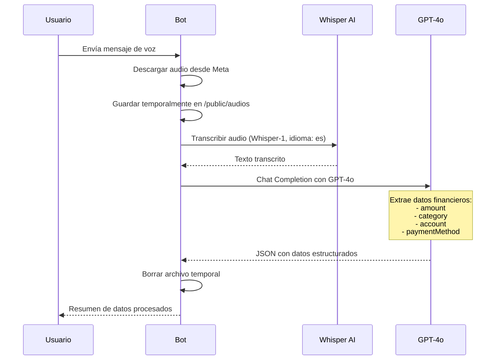

# 🤖 Pagado Bot - Asistente Financiero para WhatsApp


Bot conversacional para WhatsApp que ayuda a los usuarios a gestionar sus finanzas personales, permitiendo registrar transacciones mediante texto, imágenes y audio, utilizando inteligencia artificial para automatizar el proceso.

---

## 📑 Tabla de Contenidos

- [Características](#-características)
- [Arquitectura](#-arquitectura)
- [Requisitos](#-requisitos)
- [Instalación](#-instalación)
- [Configuración](#-configuración)
- [Estructura del Proyecto](#-estructura-del-proyecto)
- [Flujos de Conversación](#-flujos-de-conversación)
- [API Endpoints](#-api-endpoints)
- [Tecnologías](#-tecnologías)
- [Scripts](#-scripts)
- [Deployment](#-deployment)
- [Seguridad](#-seguridad)
- [Próximas Funcionalidades](#-próximas-funcionalidades)
- [Contribuciones](#-contribuciones)
- [Licencia](#-licencia)

---

## ✨ Características

### 🧾 Gestión de Transacciones
- **Registro de ingresos y gastos** mediante flujos conversacionales intuitivos
- Selección de categorías, cuentas y métodos de pago personalizados
- Soporte para múltiples monedas (ARS, USD, EUR, etc.)

### 🖼️ Procesamiento de Imágenes con OpenAI Vision
- **Análisis automático de tickets y facturas** mediante GPT-4o-mini Vision
- Extracción inteligente de montos, categorías y métodos de pago
- Conversión automática de imágenes a datos estructurados

### 🎤 Reconocimiento de Voz con Whisper AI
- **Transcripción de mensajes de voz** a texto usando OpenAI Whisper-1
- Procesamiento en español con alta precisión
- Extracción automática de datos financieros del audio transcrito

### 👥 Multi-Cuenta
- Soporte para múltiples cuentas por usuario (Cuenta Corriente, Caja de Ahorro, Efectivo, etc.)
- Asociación de métodos de pago específicos por cuenta
- Gestión independiente de transacciones por cuenta

### 🏷️ Categorización Inteligente
- Categorías personalizables por usuario
- Sugerencias automáticas mediante IA
- Validación y normalización de categorías

### ⚡ Cache Inteligente con TTL
- **Sistema de caché en memoria** con tiempo de vida (TTL) de 5 minutos
- Reducción de llamadas a la API externa
- Actualización automática al expirar el caché
- Mejora significativa en tiempos de respuesta

### 💬 Interfaz Nativa de WhatsApp
- Uso de **listas interactivas** de WhatsApp para selección de opciones
- Experiencia de usuario fluida y familiar
- Mensajes con formato enriquecido (negritas, emojis)

---

## 🏗️ Arquitectura



### Componentes Clave

#### 1. **Provider Layer** (`src/provider/index.ts`)
- Integración con Meta Provider para comunicación con WhatsApp Business API
- Gestión de mensajes entrantes y salientes
- Soporte para diferentes tipos de contenido (texto, imagen, audio)

#### 2. **Cache Layer** (`src/cache/userCache.ts`)
- Sistema de caché en memoria para datos de usuario
- TTL de 5 minutos para balance entre rendimiento y actualización
- Almacena: email, categorías, cuentas, métodos de pago

#### 3. **Template Layer** (`src/templates/`)
- **Main Flow**: Punto de entrada, valida usuario y redirige
- **Template With AI**: Para procesamiento con inteligencia artificial
- **Template Without AI**: Para flujos tradicionales basados en texto
- **List Templates**: Flujos específicos (gastos, ingresos, deudas, ahorros, inversiones)

#### 4. **AI Processing**
- **Image Upload**: Procesamiento de tickets con GPT-4o-mini Vision
- **Audio Upload**: Transcripción con Whisper-1 y extracción con GPT-4o

---

## 📋 Requisitos

- **Node.js** >= 18.x
- **npm** >= 9.x
- **WhatsApp Business Account** con acceso a la API de Meta
- **OpenAI API Key** con acceso a GPT-4o y Whisper
- **Backend API** configurado y en ejecución

---

## 🚀 Instalación

```bash
# Clonar el repositorio
git clone https://github.com/tu-usuario/pagado-bot.git
cd pagado-bot

# Instalar dependencias
npm install

# Configurar variables de entorno
cp .env.example .env
# Editar .env con tus credenciales

# Compilar el proyecto
npm run build

# Iniciar en modo desarrollo
npm run dev

# Iniciar en producción
npm start
```

---

## ⚙️ Configuración

### Variables de Entorno (.env)

```env
# OpenAI Configuration
OPENAI_API_KEY=sk-your-openai-api-key

# Meta/WhatsApp Configuration
META_ACCESS_TOKEN=your-meta-access-token
VERIFY_TOKEN=your-verify-token
PHONE_NUMBER_ID=your-phone-number-id

# Backend API Configuration
API_URL=http://localhost:3000/api
API_SECRET_TOKEN=your-backend-api-token

# Server Configuration
PORT=3008
```

### Configuración de Webhooks (Meta)

1. Configurar webhook URL: `https://your-domain.com/webhook`
2. Suscribirse a los eventos:
   - `messages`
   - `messaging_postbacks`
3. Validar token de verificación

---

## 📂 Estructura del Proyecto

```
pagado_bot/
├── src/
│   ├── app.ts                          # Punto de entrada principal
│   ├── provider/
│   │   └── index.ts                    # Configuración del Meta Provider
│   ├── cache/
│   │   └── userCache.ts                # Sistema de caché de usuario
│   ├── helpers/
│   │   └── formatedAmount.ts           # Helpers de formato
│   ├── templates/
│   │   ├── index.ts                    # Exportación de templates
│   │   ├── mainFlow.ts                 # Flujo principal de bienvenida
│   │   ├── templateWithAI.ts           # Template con IA
│   │   ├── templateWithOutAI.ts        # Template sin IA
│   │   └── list_templates/
│   │       ├── gastos.ts               # Flujo de gastos
│   │       ├── ingresos.ts             # Flujo de ingresos
│   │       ├── deudas.ts               # Flujo de deudas
│   │       ├── ahorros.ts              # Flujo de ahorros
│   │       ├── inversiones.ts          # Flujo de inversiones
│   │       ├── gastosRecurrentes.ts    # Gastos recurrentes
│   │       ├── imageUpload.ts          # Procesamiento de imágenes
│   │       ├── audioMessage.ts         # Procesamiento de audio
│   │       └── gastosIngresos/
│   │           ├── agregarGasto.ts     # Agregar gasto
│   │           ├── agregarIngreso.ts   # Agregar ingreso
│   │           ├── ultimoGasto.ts      # Último gasto
│   │           └── ultimoIngreso.ts    # Último ingreso
│   └── config/
│       └── index.ts                    # Configuración general
├── public/
│   └── audios/                         # Almacenamiento temporal de audios
├── dist/                               # Código compilado
├── node_modules/
├── package.json
├── tsconfig.json
├── rollup.config.js
├── .eslintrc.json
├── .env
└── README.md
```

---

## 🔄 Flujos de Conversación

### Flujo de Inicio (Welcome)



### Flujo de Agregar Gasto



### Flujo de Procesamiento de Imagen



### Flujo de Procesamiento de Audio



---

## 🌐 API Endpoints

### Backend API (Requerido)

#### 1. **GET /api/user/phone/:phone**
Obtiene datos del usuario por número de teléfono.

**Request:**
```
GET /api/user/phone/1234567890
Authorization: Bearer {API_SECRET_TOKEN}
```

**Response:**
```json
{
  "email": "usuario@example.com",
  "name": "Usuario de Ejemplo",
  "phone": "1234567890"
}
```

#### 2. **GET /api/category?mail={email}**
Obtiene las categorías del usuario.

**Request:**
```
GET /api/category?mail=usuario@example.com
Authorization: Bearer {API_SECRET_TOKEN}
```

**Response:**
```json
{
  "formattedCategories": [
    { "id": "1", "nombre": "Comida" },
    { "id": "2", "nombre": "Transporte" },
    { "id": "3", "nombre": "Servicios" }
  ]
}
```

#### 3. **GET /api/accounts?mail={email}**
Obtiene las cuentas del usuario.

**Request:**
```
GET /api/accounts?mail=usuario@example.com
Authorization: Bearer {API_SECRET_TOKEN}
```

**Response:**
```json
{
  "formattedAccounts": [
    { "id": "1", "title": "Cuenta Corriente" },
    { "id": "2", "title": "Caja de Ahorro" },
    { "id": "3", "title": "Efectivo" }
  ]
}
```

#### 4. **GET /api/methods?mail={email}**
Obtiene los métodos de pago del usuario.

**Request:**
```
GET /api/methods?mail=usuario@example.com
Authorization: Bearer {API_SECRET_TOKEN}
```

**Response:**
```json
{
  "formattedMethods": [
    {
      "id": "1",
      "title": "Visa",
      "cardType": "Crédito",
      "idAccount": "1"
    },
    {
      "id": "2",
      "title": "Efectivo",
      "cardType": null,
      "idAccount": "3"
    }
  ]
}
```

#### 5. **POST /api/transaction?mail={email}**
Registra una nueva transacción.

**Request:**
```
POST /api/transaction?mail=usuario@example.com
Authorization: Bearer {API_SECRET_TOKEN}
Content-Type: application/json

{
  "id": "",
  "description": "Almuerzo",
  "type": "expense",
  "category": "Comida",
  "amount": 5000,
  "date": "2025-10-03T12:00:00.000Z",
  "currency": "ARS",
  "account": "Cuenta Corriente",
  "method": "Visa"
}
```

**Response:**
```json
{
  "success": true,
  "message": "Transacción registrada correctamente",
  "transactionId": "abc123"
}
```

---

## 🛠️ Tecnologías

### Core
- **TypeScript** 5.4.3 - Lenguaje principal
- **Node.js** >= 18.x - Runtime

### Framework
- **BuilderBot** 1.2.2 - Framework para bots conversacionales
- **Meta Provider** 1.2.2 - Integración con WhatsApp Business API

### Inteligencia Artificial
- **OpenAI** 5.19.1
  - **GPT-4o** - Procesamiento de audio transcrito
  - **GPT-4o-mini** - Análisis de imágenes (Vision API)
  - **Whisper-1** - Transcripción de audio a texto

### HTTP & APIs
- **Axios** 1.9.0 - Cliente HTTP para APIs

### Desarrollo
- **ESLint** 8.52.0 - Linter de código
- **Nodemon** 3.1.0 - Auto-reload en desarrollo
- **Rollup** 4.10.0 - Bundler y build
- **tsx** 4.7.1 - TypeScript execution

---

## 📜 Scripts

```bash
# Desarrollo
npm run dev          # Inicia el servidor en modo desarrollo con auto-reload

# Producción
npm run build        # Compila el proyecto a JavaScript
npm start            # Inicia el servidor en producción

# Linting
npm run lint         # Ejecuta ESLint en todo el proyecto
```

---

## 🐳 Deployment

### Docker (Recomendado)

```dockerfile
# Dockerfile
FROM node:18-alpine

WORKDIR /app

# Copiar archivos de configuración
COPY package*.json ./
COPY tsconfig.json ./
COPY rollup.config.js ./

# Instalar dependencias
RUN npm ci --only=production

# Copiar código fuente
COPY src ./src

# Compilar
RUN npm run build

# Crear directorio para audios
RUN mkdir -p public/audios

# Exponer puerto
EXPOSE 3008

# Comando de inicio
CMD ["npm", "start"]
```

```yaml
# docker-compose.yml
version: '3.8'

services:
  pagado-bot:
    build: .
    ports:
      - "3008:3008"
    env_file:
      - .env
    volumes:
      - ./public/audios:/app/public/audios
    restart: unless-stopped
```

**Comandos:**
```bash
# Construir imagen
docker-compose build

# Iniciar servicio
docker-compose up -d

# Ver logs
docker-compose logs -f

# Detener servicio
docker-compose down
```

### Deployment en Cloud

#### Vercel / Railway / Render
1. Conectar repositorio de GitHub
2. Configurar variables de entorno
3. Comando de build: `npm run build`
4. Comando de inicio: `npm start`
5. Puerto: `3008`

#### AWS EC2 / DigitalOcean
```bash
# Instalar Node.js
curl -fsSL https://deb.nodesource.com/setup_18.x | sudo -E bash -
sudo apt-get install -y nodejs

# Clonar repositorio
git clone https://github.com/tu-usuario/pagado-bot.git
cd pagado-bot

# Instalar dependencias y compilar
npm install
npm run build

# Usar PM2 para gestión de procesos
npm install -g pm2
pm2 start dist/app.js --name pagado-bot
pm2 save
pm2 startup
```

---

## 🔒 Seguridad

### Mejores Prácticas

1. **Variables de Entorno**
   - Nunca commitear el archivo `.env`
   - Usar secretos seguros en producción
   - Rotar tokens periódicamente

2. **Autenticación**
   - Validar tokens de Meta en cada webhook
   - Usar HTTPS en producción
   - Implementar rate limiting

3. **Validación de Datos**
   - Sanitizar inputs de usuario
   - Validar tipos y formatos
   - Prevenir inyección de código

4. **Manejo de Archivos**
   - Borrar archivos temporales después del procesamiento
   - Limitar tamaño de archivos
   - Validar tipos MIME

5. **API Calls**
   - Usar autenticación Bearer en todas las llamadas
   - Implementar timeouts
   - Manejar errores de red

---

## 🚧 Próximas Funcionalidades

- [ ] Reportes mensuales automáticos
- [ ] Notificaciones de límites de gasto
- [ ] Integración con bancos (Open Banking)
- [ ] Exportación a Excel/PDF
- [ ] Presupuestos y metas de ahorro
- [ ] Análisis predictivo con IA
- [ ] Soporte multiidioma
- [ ] Recordatorios de pagos recurrentes

---

## 📄 Licencia

Este proyecto está bajo la licencia ISC.

---

Desarrollado con ❤️ usando [BuilderBot](https://builderbot.vercel.app/) y [OpenAI](https://openai.com/)
